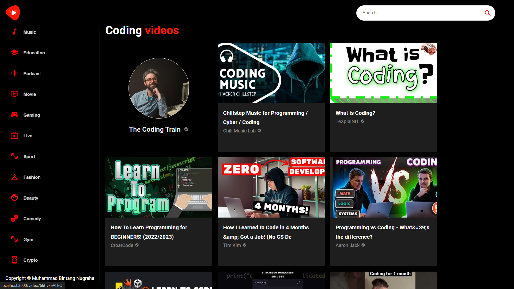

# Build Video Player Application in React JS with Material UI 5



### Cloning the repository

```shell
git clone https://github.com/bintangnugrahaa/video-player.git
```

### Install packages

```shell
npm install
```

### Setup .env file


```js
REACT_APP_RAPID_API_KEY=
```

### Start the app

```shell
npm start
```